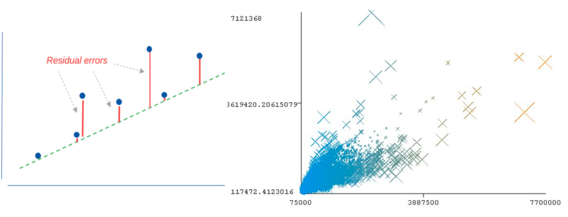
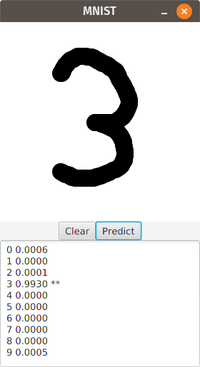
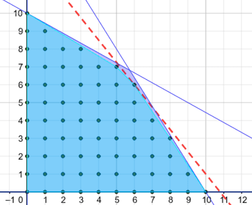

# Data Science with Groovy

Groovy is a powerful multi-paradigm programming language for the JVM that offers a wealth of features that make it ideal for many data science and big data scenarios.

* Groovy has a dynamic nature like Python, which means that it is very powerful, easy to learn, and productive. The language gets out of the way and lets data scientists write their algorithms naturally.

* Groovy has a static nature like Java and Kotlin, which makes it fast when needed. Its close alignment with Java means that you can often just cut-and-paste the Java examples from various big data solutions and they’ll work just fine in Groovy.

* Groovy has first-class functional support, meaning that it offers features and allows solutions similar to Scala. Functional and stream processing with immutable data structures can offer many advantages when working in parallel processing or clustered environments.

This repo has examples of using Groovy with various Data Science libraries.

Math/Data Science libraries covered include: 
[Weka](https://www.cs.waikato.ac.nz/ml/weka/),
[Smile](http://haifengl.github.io/),
[Apache Commons Math](https://commons.apache.org/proper/commons-math/),
[Jupyter/Beakerx](http://beakerx.com/) notebooks,
[Tablesaw](https://tablesaw.tech/),
[Apache OpenNLP](https://opennlp.apache.org/),
[Deep Learning4J](https://deeplearning4j.org/).

Libraries for scaling/concurrency include: 
[Apache Spark](https://spark.apache.org/),
[Apache Ignite](https://ignite.apache.org/),
[Apache MXNet](https://mxnet.apache.org/),
[GPars](http://gpars.org/),
[Apache Beam](https://beam.apache.org/).

### House price prediction with regression

Linear regression will enable us to find a "best fit" linear relationship between some properties or features of interest.
Ordinary least squares finds such a relationship by minimising residual errors.
This example uses linear regression to explore predicting house prices from a number
of other features such as number of bedrooms, number of bathrooms,
living space etc.
The examples illustrate several alternative dataframe libraries,
several CVS handling libraries and a number of visualization options.

Groovy code examples can be found in the [HousePrices](subprojects/HousePrices/src/main/groovy) subproject.
If you have opened the repo in IntelliJ (or your favourite IDE) you should be able to execute the examples directly in the IDE.

Alternatively, you can run the main examples online using a Jupyter/Beakerx notebook:

It can be potentially difficult to scale linear regression.
How do you minimise residual errors on data spread across different
threads/clusters/CPUs?
Some regression algorithm variants like stochastic gradient descent are amenable to scaling.
And some frameworks support such algorithms. The following subprojects highlight frameworks
with special support for scaling linear regression:

* The [HousePricesIgnite](subprojects/HousePricesIgnite/src/main/groovy) subproject which illustrates scaling up to a cluster using Apache Ignite.

* The [HousePricesSpark](subprojects/HousePricesSpark/src/main/groovy) subproject which illustrates scaling up to a cluster using Apache Spark.

If you find that your algorithm isn't directly amenable to scaling
you can often tweak it or apply it in some fashion to ensure certain
constraints hold. This can enable you to still scale up.
The following subprojects highlight tweaking linear regression
for scaling purposes:

* The [HousePricesBeam](subprojects/HousePricesBeam/src/main/groovy) subproject which illustrates scaling up to a cluster using Apache Beam.

* The [HousePricesGPars](subprojects/HousePricesGPars/src/main/groovy) subproject which illustrates scaling up concurrently using GPars.

__Requirements__: Some examples run only on JDK 8, e.g. examples using GroovyFX. Most others run on JDK 8 or 11.

### Whiskey clustering with K-means

K-means is the most common form of “centroid” clustering.
Unlike classification, clustering is an unsupervised learning method.
The categories are not predetermined but instead represent natural groupings
which are found as part of the clustering process.
Members of each cluster should be similar to each other and
different from the members of the other clusters.
The K represents the number of clusters to find.
This example uses K-means to look at grouping together
similar Whiskey drinks from various distilleries.

Groovy code examples can be found in the [Whiskey](subprojects/Whiskey/src/main/groovy) subproject.
If you have opened the repo in IntelliJ (or your favourite IDE) you should be able to execute the examples directly in the IDE.

Alternatively, you can run the main examples online using a Jupyter/Beakerx notebook:

The complete repo has additional examples using alternative clustering algorithms or visualization options. See also:

* The [WhiskeyIgnite](subprojects/WhiskeyIgnite/src/main/groovy) subproject which illustrates scaling up to a cluster using Apache Ignite.

* The [WhiskeySpark](subprojects/WhiskeySpark/src/main/groovy) subproject which illustrates scaling up to a cluster using Apache Spark.

### Natural language processing

Natural language processing may involve language detection, parsing, part-of-speech tagging and other activities.
This example makes use of a pre-trained language model to detect the language used for a fragment of text.
It uses the [Apache OpenNLP](https://opennlp.apache.org/) library.

Groovy code examples can be found in the [LanguageDetect](subprojects/LanguageDetect/src/main/groovy) subproject.
If you have opened the repo in IntelliJ (or your favourite IDE) you should be able to execute the examples directly in the IDE.

Alternatively, you can run the example online using a Jupyter/Beakerx notebook:

### Digit recognition using neural networks

An artificial neural network consists of layers of nodes which talk to other nodes based on weights and thresholds.
It mimics to some degree the way in which neurons are interconnected in biological neural networks.
Neural networks are particularly good when some degree of fuzziness is required in the processing activity.
They are popular for speech and image recognition and medical diagnosis among other areas.
This example looks at using neural networks for digit recognition.

More details can be found in the [Mnist](subprojects/Mnist/) subproject.
It contains examples using hand-written neural networks with
[Apache Commons Math](https://commons.apache.org/proper/commons-math/) used for matrix calculations
and multilayer perceptron examples using
[Deep Learning4J](https://deeplearning4j.org/).

### Diet optimization

Optimization algorithms aren't exclusively related just to data science but
never-the-less can crop up quite often. This case study looks at using linear programming
to optimize a diet problem. Given the cost and nutrition values of various
foods, can we minimise the cost of a diet but still meet various
health requirements for the diet.
There are examples which use
[Apache Commons Math](https://commons.apache.org/proper/commons-math/),
[Choco](http://www.choco-solver.org/),
[Ojalgo](https://www.ojalgo.org/),
and the [SAS](https://www.sas.com/en_us/home.html) Groovy integration.

Groovy code examples can be found in the [Diet](subprojects/Diet/src/main/groovy) subproject.
If you have opened the repo in IntelliJ (or your favourite IDE) you should be able to execute the examples directly in the IDE.

Alternatively, you can run the Apache Commons Math example online using a Jupyter/Beakerx notebook:

### Cryptarithmetic puzzle with constraint programming

While not often spoken about as a classic data science technique,
constraint programming can be a very useful tool in numerous scenarios.
It allows users to specify characteristics of a problem as high-level constraints
and then invoke a solution engine which will apply back-tracking,
constraint propagation and perhaps heuristics to find a solution matching the constraints.
This example solves a classic cryparithmetic puzzle using constraint programming.
The Groovy solution is contrasted with brute-force approaches and python solutions.

Groovy code examples can be found in the [SendMoreMoney](subprojects/SendMoreMoney/src/main/groovy) subproject.
If you have opened the repo in IntelliJ (or your favourite IDE) you should be able to execute the examples directly in the IDE.

Alternatively, you can run the examples online using a Jupyter/Beakerx notebook:

