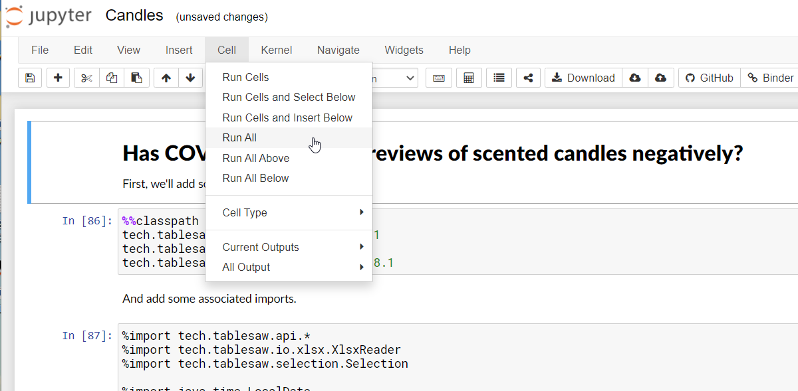
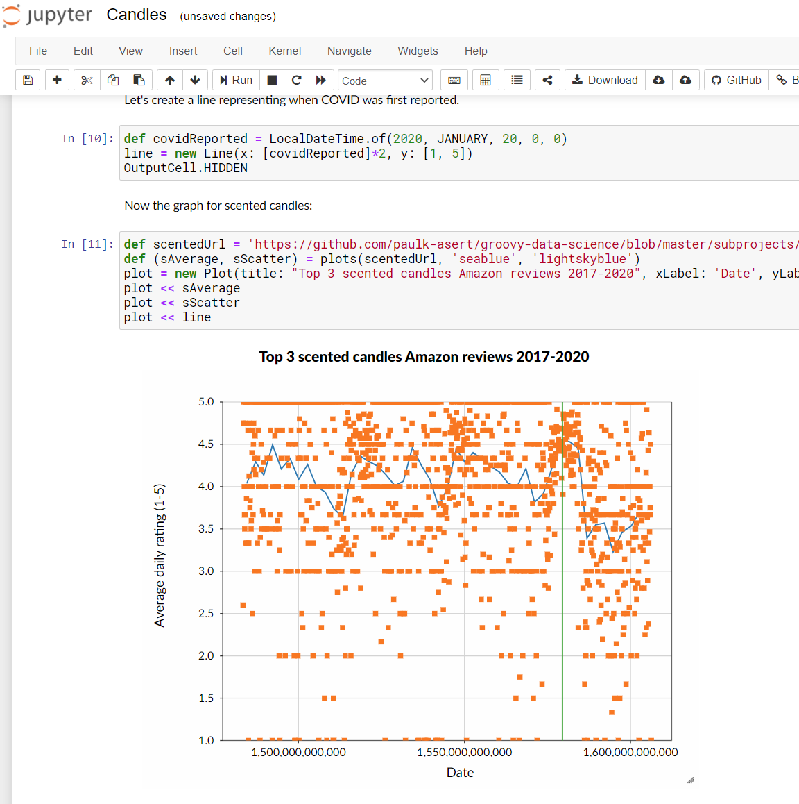

## Running via Jupyter/BeakerX

Some of the examples have links (look out for ).
Clicking on the binder icon will, after a short delay, load a web-hosted environment for running examples within a notebook.
Running is done via "Cell -> Run All":

 
Output will be similar to below:

