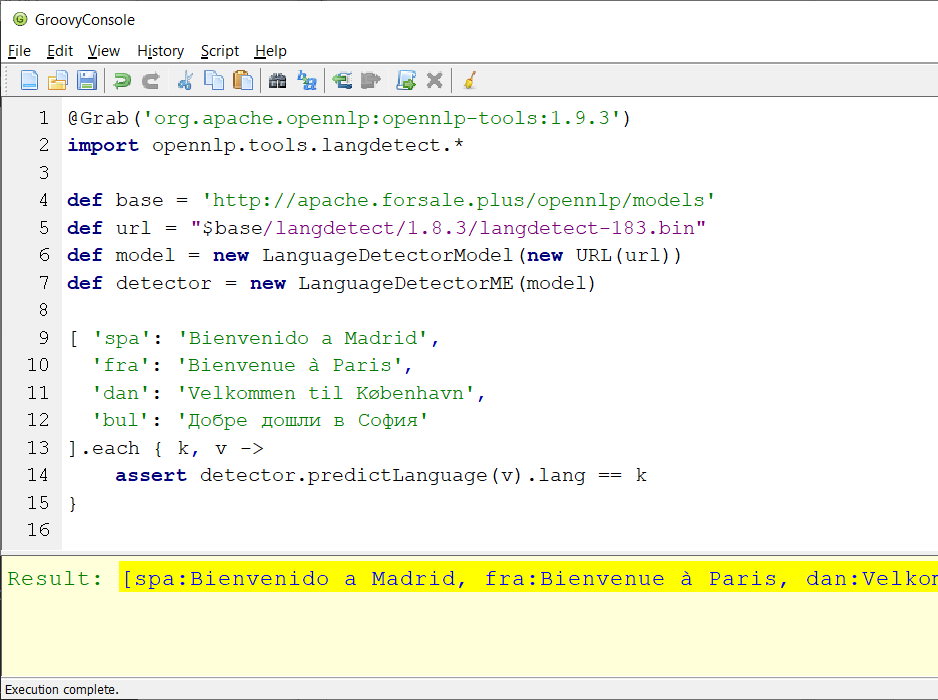
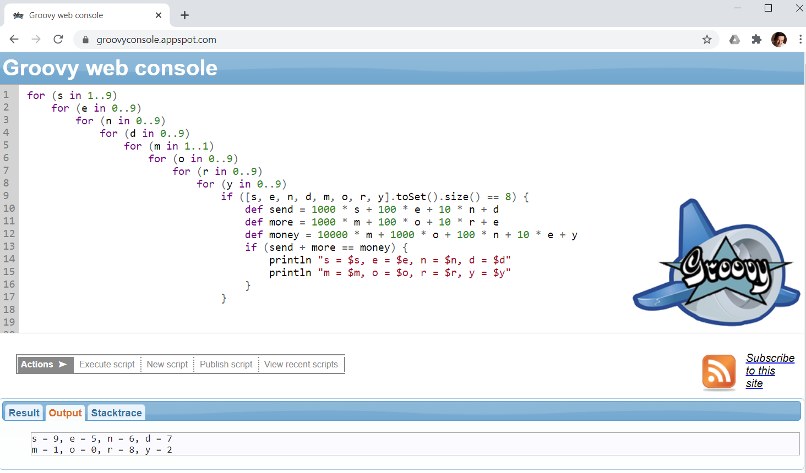

## Running via Groovy Console/Groovy Web Console

If you have Groovy installed, simply start your Groovy Console and
cut-and-paste examples into the Console. You might need to add @Grab statements
at the top of the file to include any necessary libraries (some source files have such statements
already included but commented out). Run the example script and the output should be similar to:

For scripts not requiring an external library (limitation to be removed in a future version of the web console),
you can run via the Groovy Web Console:

