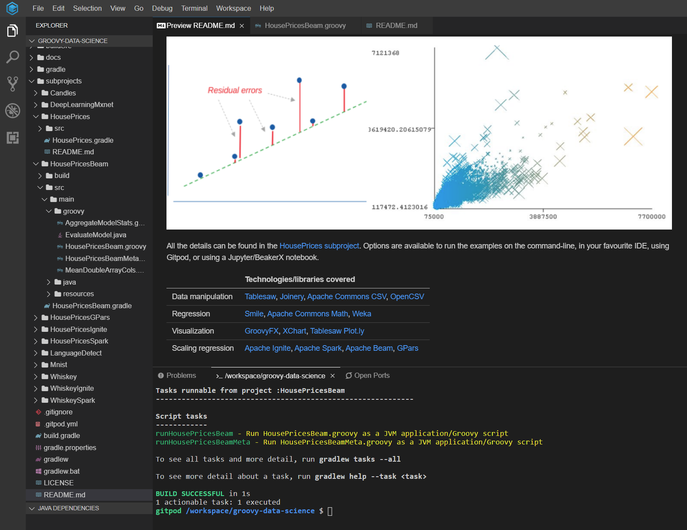
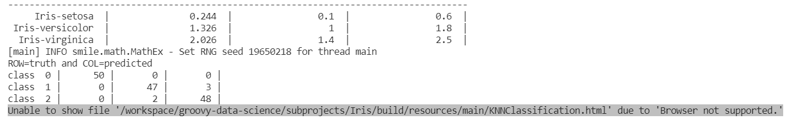
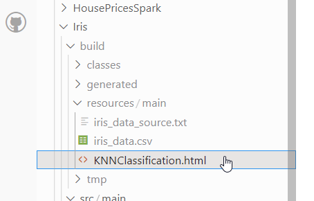
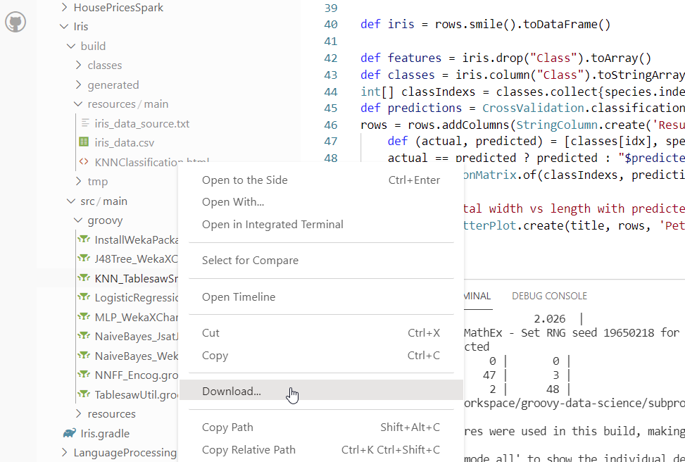

## Running via Gitpod

[](https://gitpod.io/#https://github.com/paulk-asert/groovy-constraint-programming)

To run via gitpod. Click on the Gitpod button on the github site.
Once loaded, run one of the available script tasks. To find
available script tasks you can try something like:

```
> ./gradlew :HousePricesBeam:tasks --group="Scripts"
```

You should see something like below:


And you can run a script with something like:
```
> ./gradlew :HousePricesBeam:runHousePricesBeam
```

With the following result:


### Troubleshooting

Gitpod isn't currently set up for scripts which
use GroovyFX/JavaFX or display plots using Swing (since they'd display on
some server in the cloud - not on your machine).
The same also applies for scripts which fire open a browser
but there is a workaround in some cases.

If you see an error in the Gradle output which mentions a file in your workspace (under the `build/resources/main` directory in our case), e.g.:



then you should be able to find that file in the Gitpod explorer, e.g.:



Earlier versions of Gitpod had an option to preview such files but this
capability seemed to break on the change to using VS Code.
There are some workarounds which involve using some VS Code extensions
but there are compromises with the variants I tried.
Similarly, commandline solutions, e.g. `gp preview file://path/to/file/MyFile.html`
had issues on various systems I tried.

By the time you read this, this issue might be fixed, but
as a workaround, I suggest _downloading_ such files for the time being
and view them on your local machine, e.g.:

