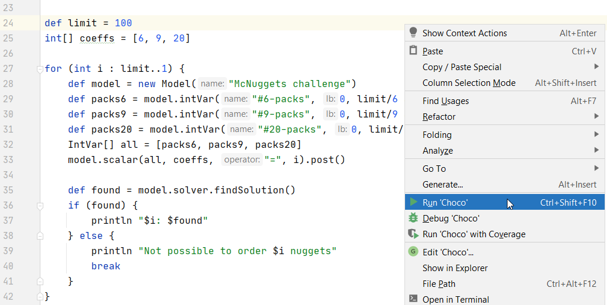

## Running locally

### Setup

Clone the repo. You can then run scripts from the command-line (various gradle tasks
have been defined to make this easy) or within your favorite IDE or the Groovy Console.

Details for cloning and showing available gradle tasks:

<details open>
<summary>Linux/MacOS</summary>

```
$ git clone https://github.com/paulk-asert/groovy-data-science.git
...
$ ./gradlew tasks
```
</details>
<details>
<summary>Windows</summary>

Assuming you have git installed:

```
> git clone https://github.com/paulk-asert/groovy-data-science.git
...
> gradlew tasks
```
</details>

Make sure you have Java installed prior to running the examples.

### Opening in your IDE

For best results, if your IDE supports opening the project in
a "Gradle aware" mode, use that feature.
For recent versions of Intellij IDEA, if you open the project at the
top level directory, this should happen automatically and the Gradle
dependencies will be sync'd with the project settings.

### Running scripts

Invoking the previously mentioned `tasks` task will let you know which
tasks are available for running from the commandline via gradlew.
For subprojects with a single script, you will typically want the `run` task.
For subprojects with multiple scripts, it will typically be "run" followed by the script name from the `src/main/groovy` directory, e.g.&nbsp;for the candle ratings script, use:
<details open>
<summary>Linux/MacOS</summary>

<pre>
$ <b>./gradlew :Candles:tasks --group="Script"</b>
> Task :Candles:tasks

------------------------------------------------------------
Tasks runnable from project ':Candles'
------------------------------------------------------------

Script tasks
------------
runCandleRatings - Run CandleRatings.groovy as a JVM application/Groovy script
runCandleReviews - Run CandleReviews.groovy as a JVM application/Groovy script
...
$ <b>./gradlew :Candles:runCandleRatings</b>
</pre>
</details>
<details>
<summary>Windows</summary>

<pre>
> <b>gradlew :Candles:tasks --group="Script"</b>
> Task :Candles:tasks

------------------------------------------------------------
Tasks runnable from project ':Candles'
------------------------------------------------------------

Script tasks
------------
runCandleRatings - Run CandleRatings.groovy as a JVM application/Groovy script
runCandleReviews - Run CandleReviews.groovy as a JVM application/Groovy script
...
> <b>gradlew :Candles:runCandleRatings</b>
</pre>
</details>

Alternatively, run any of the scripts directly in the IDE, e.g.&nbsp;for IDEA:



### Troubleshooting

* Numerous scripts present their results via "opening" one or more created figures.
The default "open" action for most operating systems is to open such figures
using your default browser.
If you have changed the default action, you might need to manually open the created files.

* Your IDE may be able to run the scripts either directly or via Gradle. Some examples
may work better in one of those particular modes.

* For some operating systems, the paths created when trying to run from the IDE may
become too large. Your IDE may have options for handling such cases, or you may
wish to fallback to using Gradle from the commandline for such cases.
