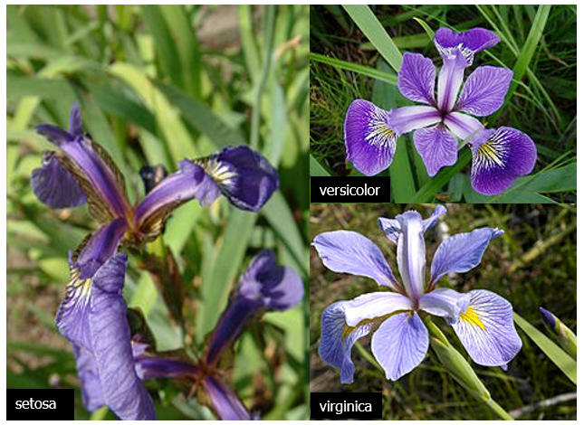
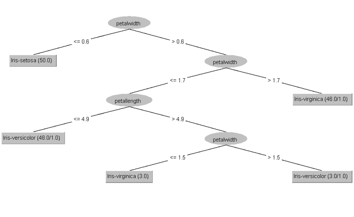
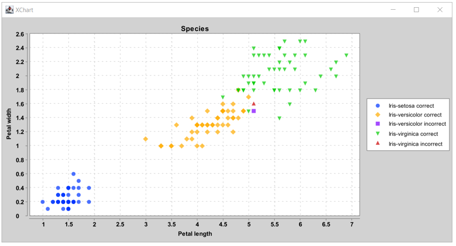
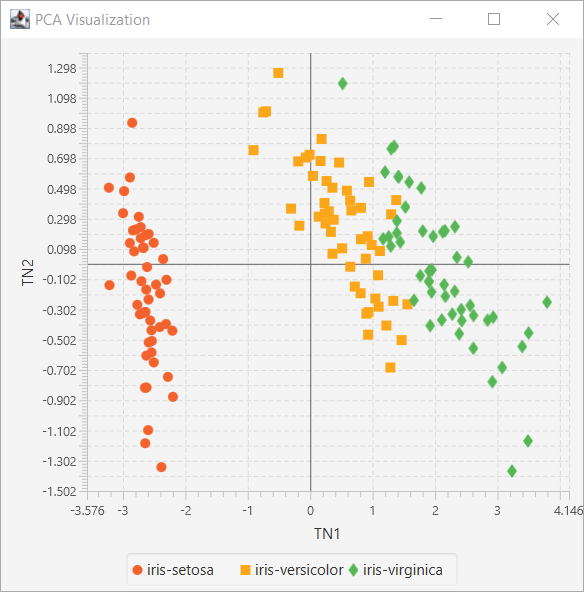

<!--
SPDX-License-Identifier: Apache-2.0

Licensed under the Apache License, Version 2.0 (the "License");
you may not use this file except in compliance with the License.
You may obtain a copy of the License at

    https://www.apache.org/licenses/LICENSE-2.0

Unless required by applicable law or agreed to in writing, software
distributed under the License is distributed on an "AS IS" BASIS,
WITHOUT WARRANTIES OR CONDITIONS OF ANY KIND, either express or implied.
See the License for the specific language governing permissions and
limitations under the License.
-->

# Iris Classification

These examples look at classifying samples of Iris flowers based
on petal width, petal length, sepal width, sepal length.
There are three species: Iris-setosa, Iris-versicolor, Iris-virginica.



Some algorithms construct a decision tree we can use to classify samples:



Others associate probabilities with each class:

```
Sample            Actual         Predicted  Confidence: setosa     versicolor virginica
    52   Iris-versicolor    Iris-virginica              0.00       0.46       0.54
    70   Iris-versicolor    Iris-virginica              0.00       0.15       0.85
    77   Iris-versicolor    Iris-virginica              0.00       0.08       0.92
   106    Iris-virginica   Iris-versicolor              0.00       0.97       0.03
   119    Iris-virginica   Iris-versicolor              0.00       0.96       0.04
   133    Iris-virginica   Iris-versicolor              0.00       0.71       0.29
6 errors were made, 4.0% error rate
```
The Iris-setosa species has a quite distinct range for its
petal width and length values but the Iris-versicolor and Iris-virginica
species are harder to distinguish as can be seen in the following chart: 



This is also shown in the resulting confusion matrix:

```
ROW=truth and COL=predicted
class  0 |      50 |       0 |       0 |
class  1 |       0 |      47 |       3 |
class  2 |       0 |       2 |      48 |
```

We could also plot class against sepal width and length or apply Principal Component Analysis (PCA):



Groovy code examples can be found in the [src/main/groovy](src/main/groovy) directory.

## Running the examples

You have several options for running the programs (see more details from the main [README](../../README.md#running-the-examples)).

* If you have opened the repo in IntelliJ (or your favourite IDE) you should be able to execute the examples directly in the IDE.

* From the command line, invoke a script with gradlew using the appropriate run&lt;_ScriptName_&gt; task.
  (Hint: `gradlew :Iris:tasks --group="Application"` will show you available task names.)

* You can run the main examples online using a Jupyter/Beakerx notebook:
  [](https://mybinder.org/v2/gh/paulk-asert/groovy-data-science/HEAD?filepath=subprojects%2FIris%2Fsrc%2Fmain%2Fnotebook%2FIris.ipynb)

* If the example has @Grab statements commented out at the top, you can cut and paste the examples into the groovyConsole
  and uncomment the grab statements. Make sure to cut and paste any helper classes too if appropriate.

### Requirements

* Examples should run fine in JDK8, JDK11 or JDK17.
* The JSAT JavaFX example requires JDK11+ or JDK8 with JavaFX included.
It uses JavaFX directly rather than GroovyFX, so the earlier JDK8-only restriction doesn't apply.

### Troubleshooting

* Numerous examples create a Swing/JavaFX GUI, so aren't suitable for running in the normal way when using Gitpod.
* Some examples use Tablesaw Plot.ly integration which fires open a browser. These will give an error if run
  using Gitpod but will create a file in the `build` folder which you may be able to preview (see earlier comments).
