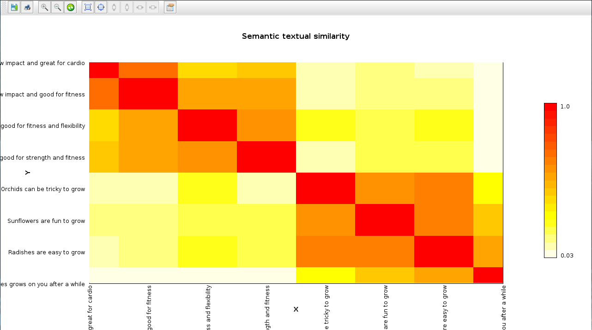

<!--
SPDX-License-Identifier: Apache-2.0

Licensed under the Apache License, Version 2.0 (the "License");
you may not use this file except in compliance with the License.
You may obtain a copy of the License at

    https://www.apache.org/licenses/LICENSE-2.0

Unless required by applicable law or agreed to in writing, software
distributed under the License is distributed on an "AS IS" BASIS,
WITHOUT WARRANTIES OR CONDITIONS OF ANY KIND, either express or implied.
See the License for the specific language governing permissions and
limitations under the License.
-->

# Language processing with DJL and TensorFlow

Neural networks with numerous layers of nodes allow for more complex, rich and _deeper_ processing and understanding.
This example uses a universal sentence encoder model from TensorFlow Hub.
It uses a pre-trained model and the
[Deep Java Library](https://djl.ai/) backed by the
[TensorFlow](https://www.tensorflow.org/) engine.

Groovy code examples can be found in the [src/main/groovy](src/main/groovy) subdirectory.
If you have opened the repo in IntelliJ (or your favourite IDE) you should be able to execute the examples directly in the IDE.

__Requirements__: The code has been tested on JDK8, JDK11 and JDK17.
