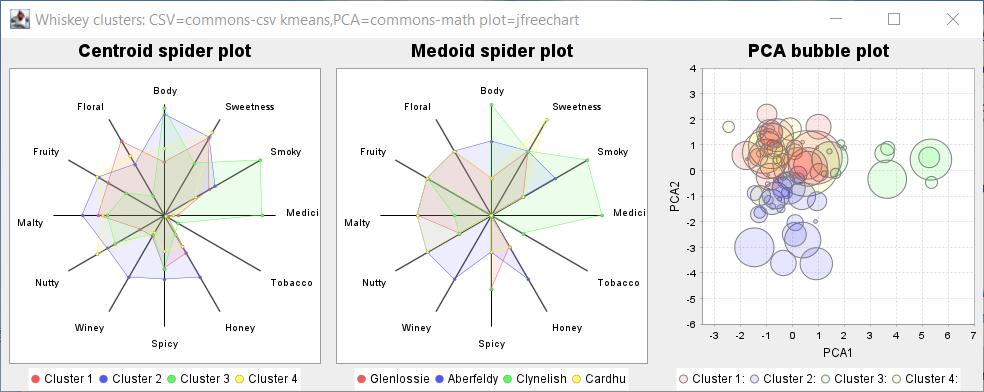

# Whiskey clustering

K-means is the most common form of “centroid” clustering.
Unlike classification, clustering is an unsupervised learning method.
The categories are not predetermined but instead represent natural groupings
which are found as part of the clustering process.
Members of each cluster should be similar to each other and
different from the members of the other clusters.
The K represents the number of clusters to find.
This example uses K-means to look at grouping together
similar Whiskey drinks from various distilleries.



Groovy code examples can be found in the [src/main/groovy](subprojects/Whiskey/src/main/groovy) directory.
You have several options for running the programs:

* If you have opened the repo in IntelliJ (or your favourite IDE) you should be able to execute the examples directly in the IDE.

* You can run the main examples online using a Jupyter/Beakerx notebook:
[](https://mybinder.org/v2/gh/paulk-asert/groovy-data-science/master?filepath=subprojects%2FWhiskey%2Fsrc%2Fmain%2Fnotebook%2FWhiskey.ipynb)

* From the command line, invoke a script with gradlew using the appropriate run&lt;_ScriptName_&gt; task.\
  (Hint: `gradlew :Whiskey:tasks --group="Script"` will show you available task names.)
* If the example has @Grab statements commented out at the top, you can cut and paste the examples into the groovyConsole
and uncomment the grab statements. Make sure to cut and paste any helper classes too if appropriate.

## KMeans


The repo has additional examples using XMeans and GMeans.

## PCA


## Dendogram


## SOM


```text
Cluster 0: Aberfeldy, Benromach
Cluster 1: Aberlour, Strathisla
Cluster 2: AnCnoc, Cardhu, Glenallachie, Glenfiddich
Cluster 3: Ardbeg, Caol Ila, Clynelish, Talisker
Cluster 4: Ardmore, GlenDeveronMacduff, OldFettercairn, Tomatin
Cluster 5: ArranIsleOf, Speyburn
Cluster 6: Auchentoshan, Glengoyne
Cluster 7: Auchroisk, Glenrothes
Cluster 8: Aultmore, Dufftown, Speyside
Cluster 9: Balblair, Craigganmore
Cluster 10: Balmenach, Glendronach, Macallan
Cluster 11: Belvenie, Benriach, Dalwhinnie
Cluster 12: BenNevis, Benrinnes, Glendullan
Cluster 13: Bladnoch, Bunnahabhain, Loch Lomond, Tamdhu, Tobermory
Cluster 14: BlairAthol, Mortlach, RoyalLochnagar
Cluster 15: Bowmore, Bruichladdich, Isle of Jura, Springbank
Cluster 16: Craigallechie, GlenMoray, Longmorn
Cluster 17: Dailuaine, Dalmore
Cluster 18: Deanston
Cluster 19: Edradour
Cluster 20: GlenElgin, Glenlivet
Cluster 21: GlenGarioch
Cluster 22: GlenGrant, Tomore
Cluster 23: GlenKeith, Knochando
Cluster 24: GlenOrd
Cluster 25: GlenScotia, Highland Park
Cluster 26: GlenSpey
Cluster 27: Glenfarclas, Glenturret
Cluster 28: Glenkinchie, Glenlossie, Tullibardine
Cluster 29: Glenmorangie, Strathmill, Tamnavulin
Cluster 30: Inchgower, Tomintoul
Cluster 31: Lagavulin, Laphroig
Cluster 32: Linkwood, RoyalBrackla
Cluster 33: Mannochmore, Scapa
Cluster 34: Miltonduff
Cluster 35: Oban
Cluster 36: OldPulteney
Cluster 37: Teaninich
```

# Scaling clustering

Not all clustering algorithms are amenable to scaling via distribution of data across a farm of processing units.
Toolkits specialising in distribution often have specialised variants of clustering algorithms.
See:

* The [WhiskeyIgnite](subprojects/WhiskeyIgnite/src/main/groovy) subproject which illustrates scaling up to a cluster using Apache Ignite.

* The [WhiskeySpark](subprojects/WhiskeySpark/src/main/groovy) subproject which illustrates scaling up to a cluster using Apache Spark.

__Requirements__:
* GroovyFX examples require JDK 8 with JavaFX, e.g. Oracle JDK8 or Zulu JDK8 bundled with JavaFX.
* Numerous examples create a Swing/JavaFX GUI, so aren't suitable for running in the normal way when using Gitpod.
* Some examples use Tablesaw Plot.ly integration which fires open a browser. These will give an error if run
  using Gitpod but will create a file in the `build` folder which you can then open by right-clicking
  in the Gitpod browser then "Open With -> Preview".
* The Datumbox examples are intended for JDK 11+.
