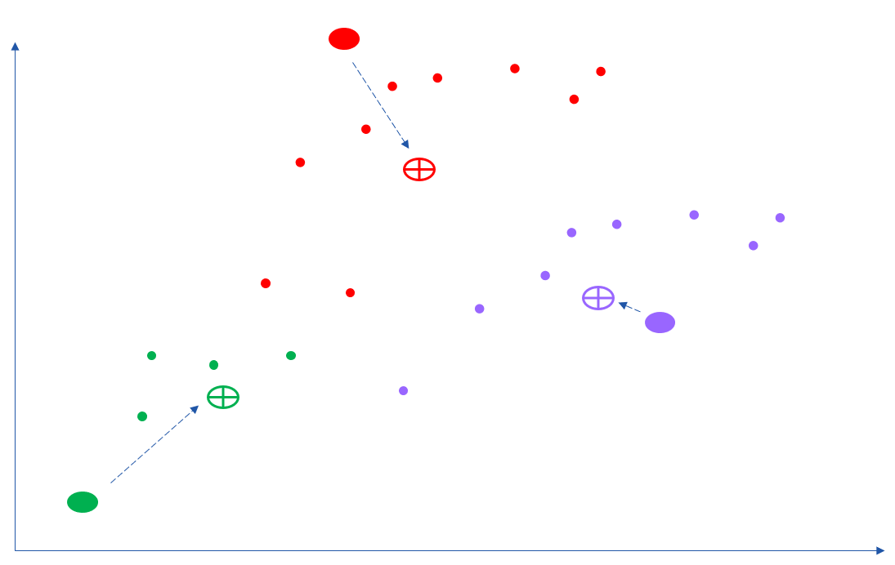
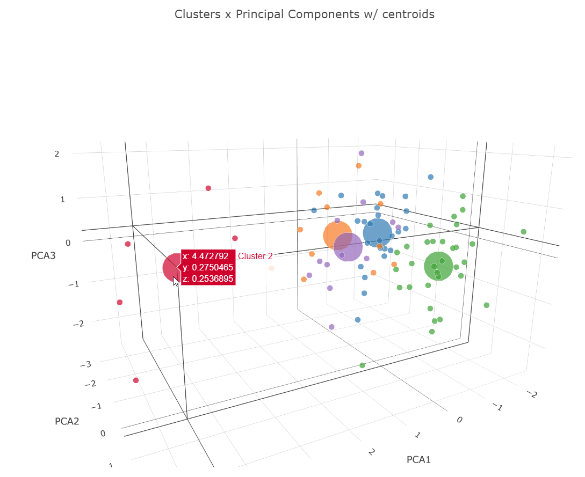
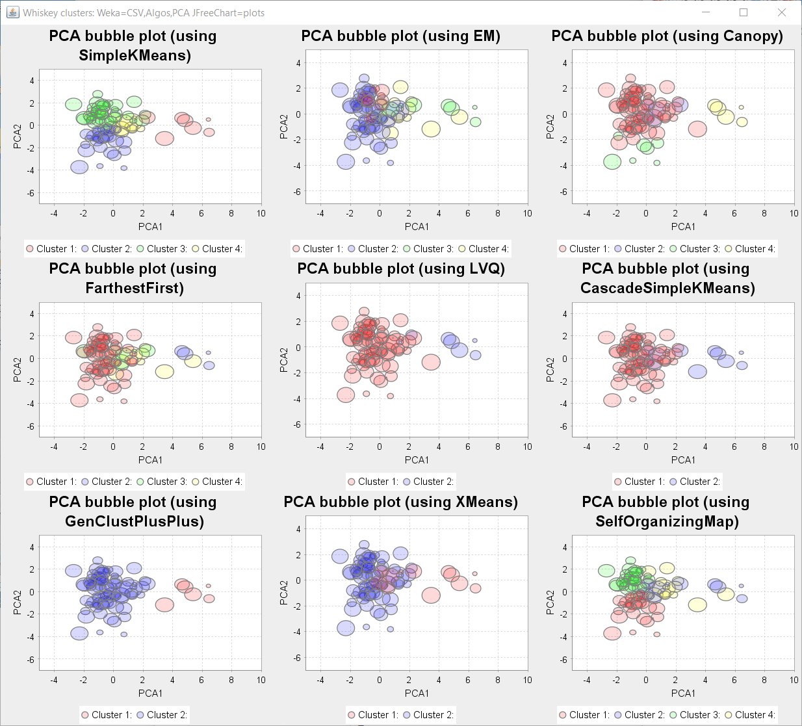
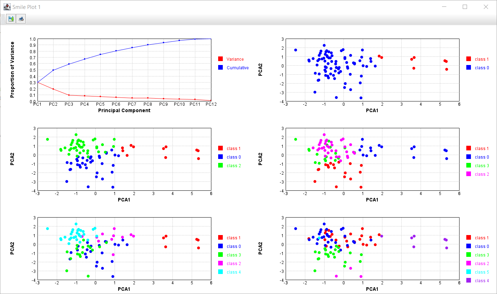
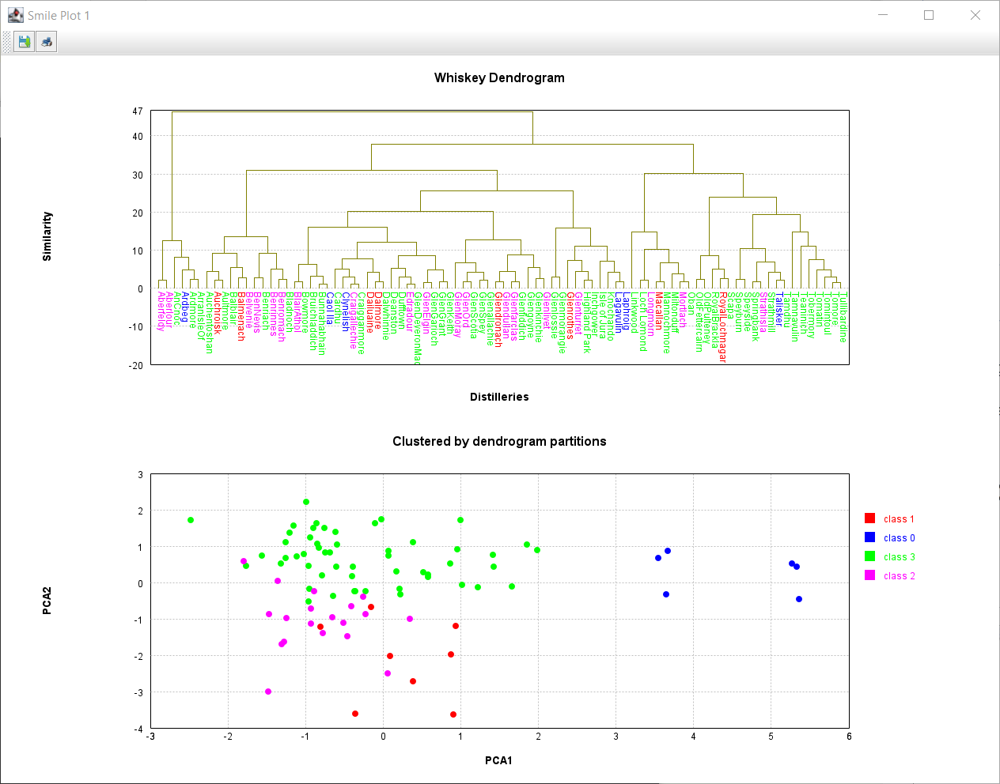
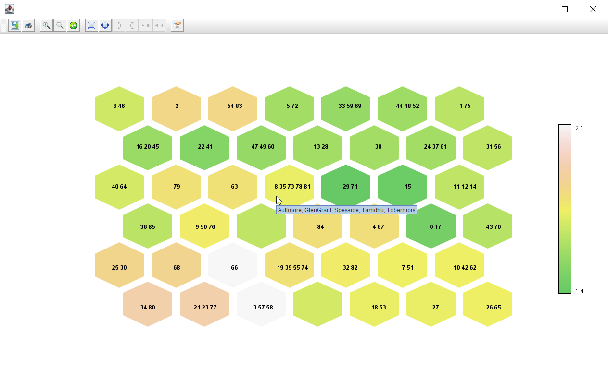

# Whiskey clustering

In an attempt to find the perfect single-malt Scotch whiskey,
the whiskies produced from [86 distilleries](https://www.niss.org/sites/default/files/ScotchWhisky01.txt) have been ranked
by expert tasters according to 12 criteria (Body, Sweetness, Malty, Smoky, Fruity, etc.).


While those rankings might prove interesting reading to some Whiskey advocates,
it is difficult to draw many conclusions from the raw data alone.
Clustering is a well-established area of statistical modelling where
data is grouped into clusters.
Members within a cluster should be similar to each other and
different from the members of other clusters.
Clustering is an unsupervised learning method.
The categories are not predetermined but instead represent natural groupings
which are found as part of the clustering process.

K-Means is the most common form of _centroid_ clustering.
The K represents the number of clusters to find.
This example uses K-Means (and other algorithms) to look at grouping together
the Whiskey drinks in our case study.


One of the other aspects which crops up when working with data having many dimensions
(12 criteria in our case) is how to visualize the data. An approach called
dimensionality reduction will be used. We'll mostly use a technique called
Principal Component Analysis (PCA) which we'll discuss later. In the third plot
of the above figure, our twelve dimensions are mapped into 4 dimensions (a 2D chart
plus color plus bubble size).

Groovy code examples can be found in the [src/main/groovy](src/main/groovy) directory.

You have several options for running the programs (see more details from the main [README](../../README.md#running-the-examples)):

* If you have opened the repo in IntelliJ (or your favourite IDE) you should be able to execute the examples directly in the IDE.

* You can run the main examples online using a Jupyter/Beakerx notebook:
[](https://mybinder.org/v2/gh/paulk-asert/groovy-data-science/master?filepath=subprojects%2FWhiskey%2Fsrc%2Fmain%2Fnotebook%2FWhiskey.ipynb)

* From the command line, invoke a script with gradlew using the appropriate run&lt;_ScriptName_&gt; task.\
  (Hint: `gradlew :Whiskey:tasks --group="Script"` will show you available task names.)
* If the example has @Grab statements commented out at the top, you can cut and paste the examples into the groovyConsole
and uncomment the grab statements. Make sure to cut and paste any helper classes too if appropriate.

See also:
* a [study](https://blog.revolutionanalytics.com/2013/12/k-means-clustering-86-single-malt-scotch-whiskies.html) which goes on to display clusters according to geographic region.

## KMeans

K-Means works by iteratively finding centroids and assigning data points to their closest
centroid.



After applying this process, we can visualize where each Whiskey is
in relation to each other (and if we wish the centroids) as shown here:



The repo illustrates K-Means for numerous data science libraries and
has additional examples using X-Means and G-Means. The Weka examples include more algorithms.
Some require you to install Weka along with some of its clustering-related optional packages.



The example above with 9 different clustering algorithms uses some
classes which aren't built-in to Weka or available in a Maven repo.
They belong to packages which can optionally be downloaded when using the Weka package manager.
The script will still run without those classes but will show fewer bubble plots.
Consider installing Weka and installing those optional packages which interest you
or run the `installWekaPackages` gradle task.

## PCA

Principal Component Analysis (PCA) maps many dimensions
onto a smaller more manageable number of _manufactured_ dimensions.
Roughly speaking, the new dimensions are simply scaled projections
of the existing dimensions, but scaled to preserve the variance in the clusters.



In the figure above, a _Screeplot_ is shown which indicates what proportion
of the variance is preserved by each dimension in the PCA projection.
Also shown are 2D projections for varying cluster sizes.

## Dendogram

Hierarchical clustering as its name suggests creates a hierarchy of clusters.
Clusters higher up in the hierarchy subsume the lower clusters.
Typically, the factor which is the most discriminating, in terms of variance,
is selected to split a cluster at any level.



Clustering is achieved by stopping the splitting process when the
desired number of clusters is reached.

## SOM

Self-Organizing Maps (SOM) is another technique for dimensionality reduction.
Neural networks are used to produce a low-dimension (typically two-dimensional)
map of the input observations. Within the map,
similar observations are mapped close together and dissimilar ones apart.



Clustering is achieved by grouping together observations
which are quantized by the neural network to the same value.

```text
Cluster 0,0: Auchentoshan, Glengoyne
Cluster 0,1: Inchgower, Tomintoul
Cluster 0,2: ArranIsleOf, Speyburn
Cluster 0,3: GlenElgin, Glenlivet
Cluster 0,4: Glenfarclas, Glenturret
Cluster 0,5: Aberlour, Strathisla
Cluster 1,0: Bladnoch, Bunnahabhain, Loch Lomond, Tamdhu, Tobermory
Cluster 1,1: AnCnoc, Cardhu, Glenallachie, Glenfiddich
Cluster 1,3: Linkwood, RoyalBrackla
Cluster 1,4: Craigallechie, GlenMoray, Longmorn
Cluster 1,5: Aberfeldy, Benromach
Cluster 2,0: GlenSpey
Cluster 2,1: Miltonduff
Cluster 2,2: Glenmorangie, Strathmill, Tamnavulin
Cluster 2,3: Glenkinchie, Glenlossie, Tullibardine
Cluster 2,4: GlenOrd
Cluster 2,5: Belvenie, Benriach, Dalwhinnie
Cluster 3,0: GlenGrant, Tomore
Cluster 3,1: Edradour
Cluster 3,2: GlenKeith, Knochando
Cluster 3,4: Deanston
Cluster 3,5: BenNevis, Benrinnes, Glendullan
Cluster 4,0: Aultmore, Dufftown, Speyside
Cluster 4,1: Mannochmore, Scapa
Cluster 4,3: Ardmore, GlenDeveronMacduff, OldFettercairn, Tomatin
Cluster 4,4: Auchroisk, Glenrothes
Cluster 4,5: BlairAthol, Mortlach, RoyalLochnagar
Cluster 5,0: Balblair, Craigganmore
Cluster 5,1: GlenGarioch
Cluster 5,2: Bowmore, Bruichladdich, Isle of Jura, Springbank
Cluster 5,3: GlenScotia, Highland Park
Cluster 5,4: Dailuaine, Dalmore
Cluster 5,5: Balmenach, Glendronach, Macallan
Cluster 6,0: Teaninich
Cluster 6,1: OldPulteney
Cluster 6,2: Lagavulin, Laphroig
Cluster 6,3: Oban
Cluster 6,4: Ardbeg, Caol Ila, Clynelish, Talisker
```

### Requirements

* Examples with the suffix "_JDK11" should work on JDK11 and above (tested with JDK11 and JDK17).
* Other examples should run on JDK8 and above (tested with JDK8, JDK11 and JDK17).

### Troubleshooting

* Numerous examples create a Swing/JavaFX GUI, so aren't suitable for running in the normal way when using Gitpod.
* Some examples use Tablesaw Plot.ly integration which fires open a browser. These will give an error if run
  using Gitpod but will create a file in the `build` folder which you may be able to preview (see earlier comments).

# Scaling clustering

Not all clustering algorithms are amenable to scaling via distribution of data across a farm of processing units.
Toolkits specialising in distribution often have specialised variants of clustering algorithms.
See:

* The [WhiskeyIgnite](subprojects/WhiskeyIgnite/src/main/groovy) subproject which illustrates scaling up to a cluster using Apache Ignite. It has been tested on JDK8, JDK11 and JDK17.

* The [WhiskeySpark](subprojects/WhiskeySpark/src/main/groovy) subproject which illustrates scaling up to a cluster using Apache Spark.

If you don't find the algorithm you need available in one of the toolkits,
you might be able to write a distributed version. As an example, see:

* The [WhiskeyRheem](subprojects/WhiskeyRheen/src/main/groovy) subproject which illustrates scaling up to a cluster using Rheem (currently incubating as Apache Wayang).
